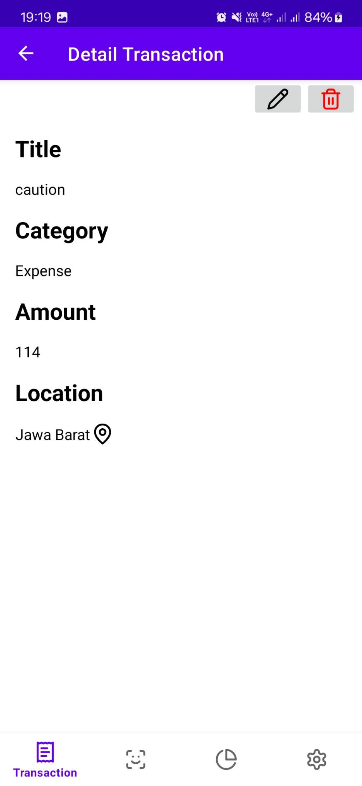
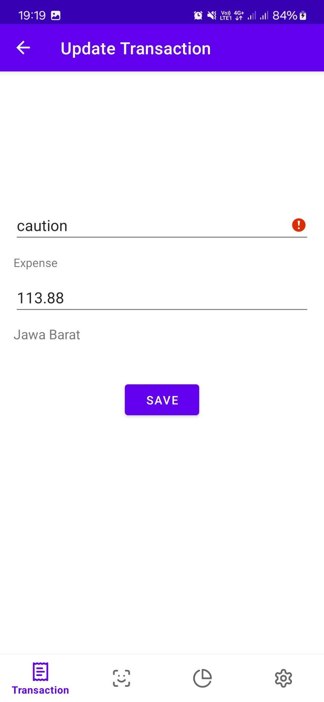
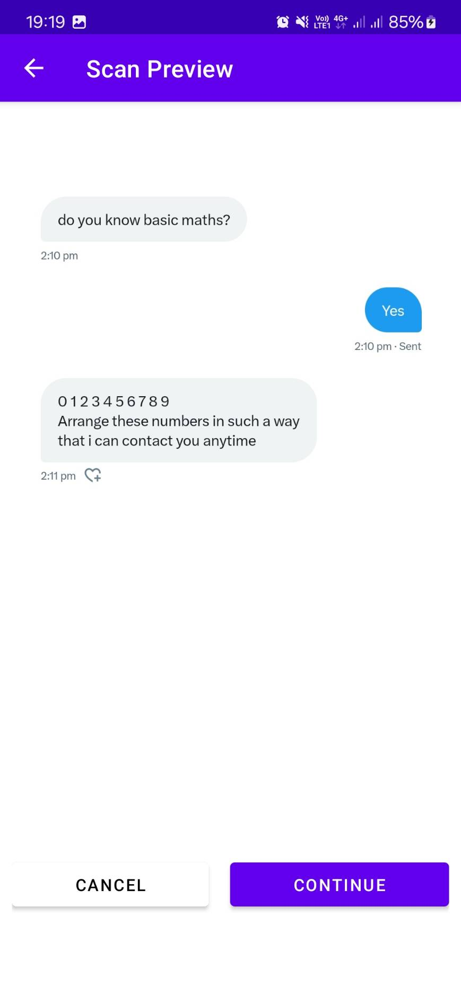
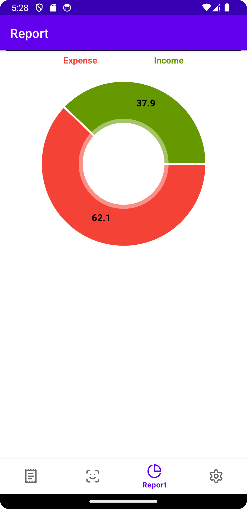

# IF3210-2024-Android-PPR

## Anggota

- Fatih Nararya R. I. (13521060)
- Razzan Daksana Yoni (13521087)
- Akbar Maulana Ridho (13521093)

## Deskripsi Aplikasi

BondoMan adalah sebuah aplikasi pencatatan pemasukan dan pengeluaran.

## Library yang Digunakan

- Apache Poi (Microsoft Excel handling)
- Retrofit
- OkHttp3
- Moshi
- Koin (dependency injection)
- Room
- CameraX

## Screenshot Aplikasi

### Login

### List Transaction

### Detail Transaction

### Create Transaction

### Update Transaction

### Scan Preview

### Report

### Settings

### Twibbon

## Pembagian Kerja

| Tugas                            | NIM                 |
|----------------------------------|---------------------| 
| Header dan Navbar                | 13521093            |
| Login                            | 13521087            |
| Logout                           | 13521060 & 13521087 |
| Create, Update, Delete Transaksi | 13521087            |
| Halaman daftar transaksi         | 13521087            |
| Scan nota                        | 13521093            |
| Halaman graf                     | 13521060            |
| Export XLSX, XLS                 | 13521093            |
| Intent Gmail                     | 13521060            |
| Background service JWT           | 13521093            |
| Network sensing                  | 13521060            |
| Broadcast receiver transaksi     | 13521087            |

## Alokasi Jam Kerja

1. Akbar Maulana Ridho - 30 jam
2. Fatih Nararya R. I. - 30 jam
3. Razzan Raksana Yoni - 30 jam
