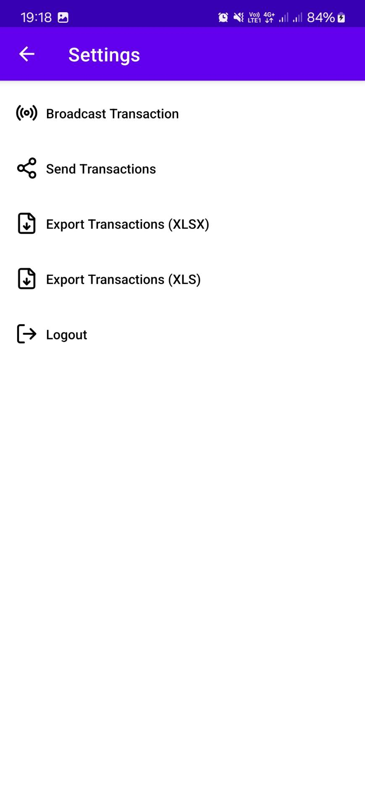
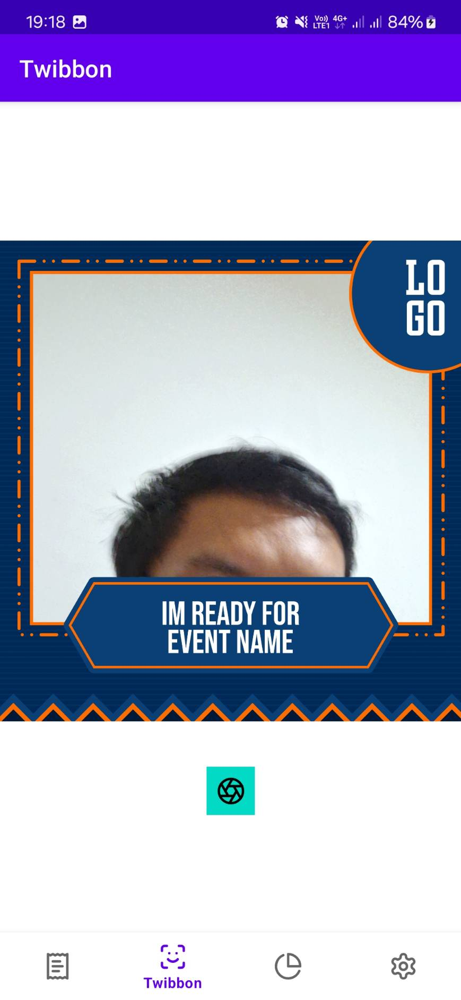
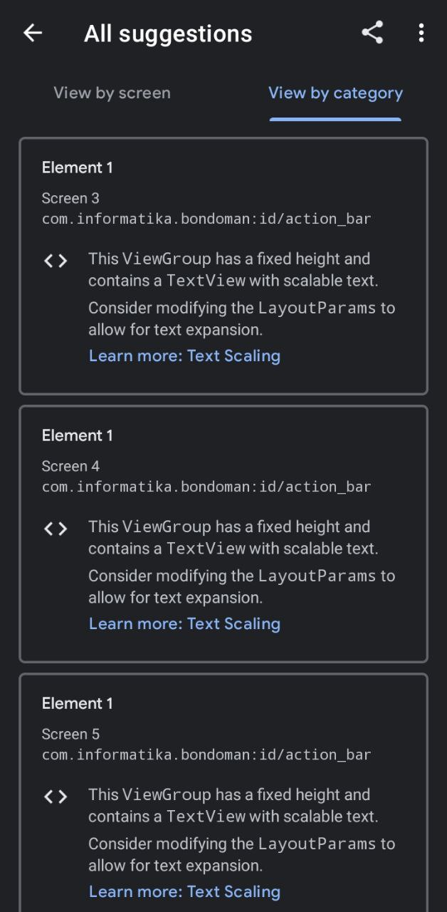

# IF3210-2024-Android-PPR

## Anggota

- Fatih Nararya R. I. (13521060)
- Razzan Daksana Yoni (13521087)
- Akbar Maulana Ridho (13521093)

## Deskripsi Aplikasi

BondoMan adalah sebuah aplikasi pencatatan pemasukan dan pengeluaran.

## Library yang Digunakan

- Apache Poi (Microsoft Excel handling)
- Retrofit
- OkHttp3
- Moshi
- Koin (dependency injection)
- Room
- CameraX
- MP Android Chart

## Screenshot Aplikasi

### Login

### List Transaction

### Detail Transaction

### Create Transaction

### Update Transaction

### Scan Preview

### Report

### Settings

### Twibbon

### Accessibility Testing

Berikut adalah tampilan hasil dari accessibility scanner aplikasi kami sebelum bonus ini dikerjakan.

Terdapat banyak sekali suggestion yang diberikan. Jika ingin melihat dengan detail perubahan yang kami lakukan, _commit_ untuk memperbaiki saran-saran tersebut dapat dicek di sini:

- [feat: initial work on accessibility](https://gitlab.informatika.org/akbarmr/if3210-2024-android-ppr/-/commit/312b789d3c1d67a1f9b01ccbdc88ade5e0e17ee2)
- [feat: continued work on accessibility](https://gitlab.informatika.org/akbarmr/if3210-2024-android-ppr/-/commit/e6ab229354179a4dfc6becf9933dd076491490ae)
- [feat: properly color the main button](https://gitlab.informatika.org/akbarmr/if3210-2024-android-ppr/-/commit/6d9dab3043b9ad64c1006adffb9aa62e63ac2b86)
- [feat: properly color the login screen](https://gitlab.informatika.org/akbarmr/if3210-2024-android-ppr/-/commit/da56d87bc4587bdaee656c16f2055a23092c740e)
- [fix: duplicate name for nav and report title page](https://gitlab.informatika.org/akbarmr/if3210-2024-android-ppr/-/commit/8342ecdf54398c15a08d65e428df5850911b405c)
- [fix: scan preview button and its container](https://gitlab.informatika.org/akbarmr/if3210-2024-android-ppr/-/commit/a6c5671e60a3df242fb93b30ed01e8fdcdaee5d8)

Kami melakukan perubahan dimulai dari yang paling mudah, yaitu permasalahan _touch target_ yang terlalu kecil. Ini sangat mudah karena kami hanya perlu meningkatkan _padding_ atau _textSize_ dari elemen yang bersangkutan. Contohnya, pada halaman _update transaction_, kami memperbesar ukuran teks dari masukan nama transaksi dan besar transaksi. Perubahan ini kami lakukan pula dengan halaman _detail transaction_.

Selain itu, terdapat juga komplain terkait _Text Scaling_ di mana _View Group_ yang mengandung _Text View_ memiliki tinggi yang tetap, padahal _Text View_ di dalamnya memiliki teks yang bersifat _scalable_. Hal ini kami temui pada halaman untuk melakukan pemindaian nota. Solusinya adalah tinggal membuat supaya _height_ dari _View Group_ tersebut menjadi _wrap_content_ untuk dapat menyesuaikan dengan ukuran elemen isinya.

Isu minor lainnya adalah terkait _navbar_ dan _activity_. Terdapat _activity_ yang memiliki label _hardcoded_ pada `AndroidManifest.xml`, yaitu `SettingsActivity`. Solusinya cukup mudah, tinggal menggunakan salah satu `string` yang ada pada `resources` untuk label _activity_ tersebut.

_Last, but certainly not least_ adalah masalah yang paling banyak ditemui pada aplikasi kami saat itu, yaitu kurangnya kontras antara _foreground_ dan _background_, baik untuk teks maupun gambar. Perbaikan ini memakan mayoritas dari pengerjaan bonus ini karena sulitnya memilih pasangan (atau bahkan _throuple_ jika warna yang dikomplen berlaku sebagai _foreground_ dan _background_) warna yang memiliki kontras bagus tetapi sekiranya masih koheren dengan keseluruhan palet warna aplikasi kami. Semua halaman kecuali halaman pengaturan musti dibenahi warna elemennya agar memiliki kontras di atas batas yang telah diberikan (4.50:1 untuk teks dan 3:1 untuk gambar). Perubahan lengkapnya ada sangat banyak, sehingga dapat dilihat langsung saja pada daftar _commit_ yang diberikan.

Hasil akhirnya setelah perubahan-perubahan yang kami lakukan adalah sebagai berikut:

Tampak bahwa tidak semua _suggestion_ yang diberikan berhasil kami selesaikan. Hal ini karena terdapat _suggestion_ yang memang tidak bisa dikerjakan. Contoh terbesarnya adalah _suggestion_ yang menumpuk terkait _text scaling_ pada bagian atas navigasi halaman. Kami tidak bisa mengerjakannya karena navigasi tersebut dibawa dari _library_ yang ada. Begitupun dengan permasalahan _unexposed text_ pada graf di halaman laporan. Kami menggunakan _library_ eksternal untuk itu, sehingga tidak dapat mengubah bagaimana teks ditampilkan di dalam graf.

Isu lain yang belum kami selesaikan sepenuhnya adalah _text contrast_. Hal ini karena memang cukup sulit untuk menentukan warna mana yang baiknya digunakan agar memenuhi spesifikasi kontras yang ada tetapi juga koheren dengan warna-warna lainnya pada aplikasi kami.

Isu-isu lain, seperti _unexposed text_ yang tidak melibatkan graf, tidak berhasil diselesaikan karena keterbatasan waktu.

## Pembagian Kerja

| Tugas                            | NIM                 |
| -------------------------------- | ------------------- |
| Header dan Navbar                | 13521093            |
| Login                            | 13521087            |
| Logout                           | 13521060 & 13521087 |
| Create, Update, Delete Transaksi | 13521087            |
| Halaman daftar transaksi         | 13521087            |
| Scan nota                        | 13521093            |
| Halaman graf                     | 13521060            |
| Export XLSX, XLS                 | 13521093            |
| Intent Gmail                     | 13521060            |
| Background service JWT           | 13521093            |
| Network sensing                  | 13521060            |
| Broadcast receiver transaksi     | 13521087            |
| Accessibility Testing            | 13521060            |

## Alokasi Jam Kerja

1. Akbar Maulana Ridho - 30 jam
2. Fatih Nararya R. I. - 30 jam
3. Razzan Daksana Yoni - 30 jam
